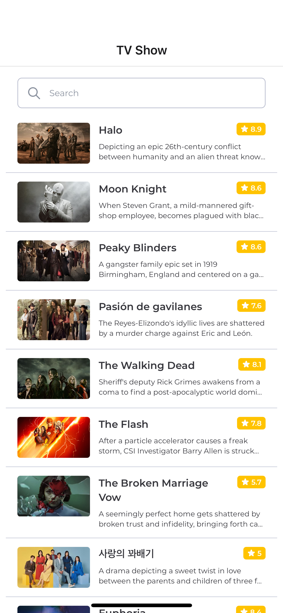
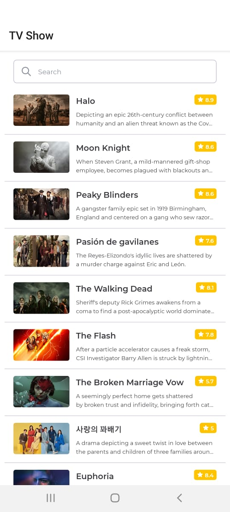
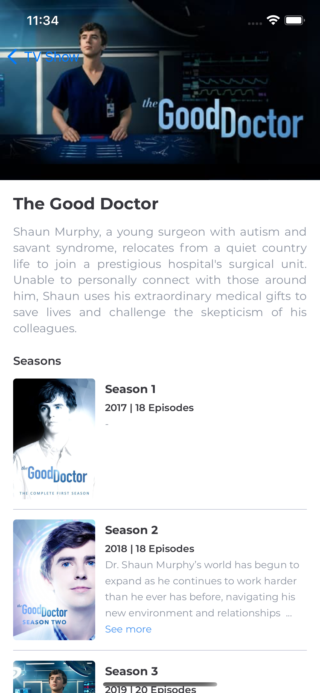
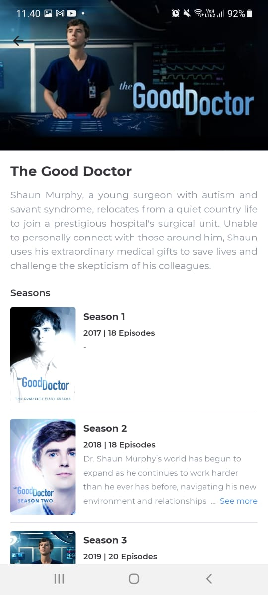

# Table of Contents

- [Table of Contents](#table-of-contents)
  - [Prerequisites](#prerequisites)
  - [First time setup](#first-time-setup)
  - [Running the app](#running-the-app)
    - [Android](#android)
    - [iOS](#ios)
  - [Build the app](#build-the-app)
    - [Android](#android-1)
  - [ScreenShots](#screenshots)
    - [TV Show](#tv-show)
    - [TV Show Detail](#tv-show-detail)

## Prerequisites
If you haven't used React Native before, you need to setting up the development environment based on [documentation](https://reactnative.dev/docs/environment-setup). Select **"React Native CLI Quickstart"** Section.

Tools to download:

- Android Studio (for Android development)
- Xcode (for iOS development)

## First time setup

```bash
# Install dependencies
yarn

# Linking Native Code on iOS
npx pod-install
```

Refer to the [React Native docs](https://reactnative.dev/docs/getting-started) to setup platform-specific development environment

## Running the app

### Android

Assuming an Android Virtual Device (AVD) is already running, run:

```bash
$ npx react-native run-android
```

### iOS

```bash
$ npx react-native run-ios
```

## Build the app

### Android

```bash
$ cd android && ./gradlew assembleRelease
```

## ScreenShots

### TV Show


<br /><br />


### TV Show Detail

